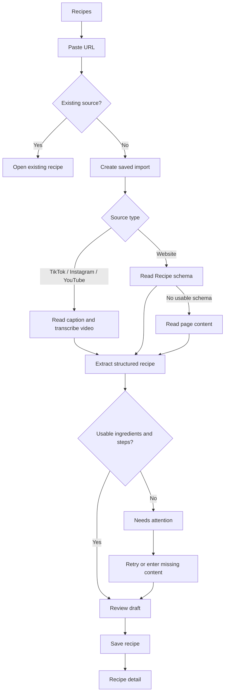

# PER-3 — Recipe Import UI/UX Plan

Status: implemented on `mohamadfurqaan/per-3-import-recipe-feature`; Railway worker deployed and fully configured

Linear: PER-3 — Import Recipe feature

Branch: `mohamadfurqaan/per-3-import-recipe-feature`

## 1. Outcome

A family member can paste a TikTok, Instagram, YouTube, or recipe website URL and get a saved, structured recipe containing:

- title
- ingredients
- ordered steps
- original source URL and source label

Social imports use the post caption/description plus a video transcript. Website imports prefer Recipe JSON-LD/schema.org data and fall back to LLM extraction from readable page content. Extraction is asynchronous and fallible, so the product saves the import as a draft and gives the user a short review step before it becomes a normal family recipe.

This feature is a first-class household tool, not another generic markdown page type. Recipes have their own index, detail route, structured editor, search group, and bottom-navigation destination, while still participating in Bluetape's `[[link]]` system as both targets and authors.

## 2. Scope boundaries

### In scope

- Paste one supported public URL at a time.
- Detect social-video versus website sources automatically.
- Show honest import stages while the job runs.
- Persist an import immediately so leaving the screen does not lose it.
- Review and correct extracted title, ingredients, and steps.
- Publish to the family recipe list.
- Open the original source from the saved recipe.
- Search recipes by title and ingredient text.
- Reference recipes from existing `[[link]]` authoring surfaces.
- Use `[[links]]` inside recipe ingredients and steps to reference notes, rules, or other recipes.
- Translate recipe title, ingredients, and steps through the existing lazy user-content translation system.
- Share a stable Bluetape recipe URL.
- Retry failed imports without pasting the link again.

### Not in the first slice

- Uploading a local video file.
- Importing from screenshots, PDFs, or plain pasted recipe text.
- Adding all ingredients to Shopping.
- Serving-size conversion, unit conversion, nutrition, timers, or meal planning.
- Persisted cooking progress/checkmarks.
- Showing or editing the raw transcript in the normal recipe UI.
- Automatically re-importing a source when the original changes.

Ingredient-to-Shopping remains a follow-up feature. The recipe layout should leave room for that action without showing a disabled or placeholder control.

## 3. Information architecture

### Routes

| Route | Purpose |
|---|---|
| `/recipes` | Recipe list plus the import entry point |
| `/recipes/import/:id` | Persistent import progress, failure, and review flow |
| `/recipes/:id` | Published recipe detail |
| `/recipes/:id/edit` | Structured recipe editor |

The import ID and recipe ID may refer to separate backend records. The URL contract should remain stable even if processing is implemented with an internal job table.

### Navigation

Mobile bottom navigation becomes five tabs, in this order:

1. Tasks
2. Routines
3. Recipes
4. Shopping
5. More

Use the Phosphor `CookingPot` icon for Recipes. Five tabs preserve access to More while giving Recipes a first-class, thumb-reachable destination. Labels retain the existing 11px `label-caps` treatment; at 320px the tab cells are 64px wide, so labels must not gain extra horizontal padding.

On desktop, insert Recipes between Routines and Shopping in the existing left rail. `/recipes`, `/recipes/import/:id`, `/recipes/:id`, and `/recipes/:id/edit` all keep Recipes active.

Search adds a Recipes group. More does not duplicate a Recipes row.

### Wiki references

- Authors continue typing the readable form, for example `[[Chicken adobo]]`.
- Existing `[[` autocomplete in tasks, routines, shopping, notes, and rules adds Recipes as a result type.
- Selecting a recipe stores a stable recipe identity and renders a link to `/recipes/:id`; renaming the recipe does not break the reference.
- Recipe ingredient and step fields use the same autocomplete and renderer, so a step can reference a household note or another recipe.
- When titles collide, suggestions show the record type and source label so the author chooses deliberately. There is no silent cross-type winner.

## 4. Primary flow



The UI never claims that an LLM-derived recipe is verified. It uses neutral copy such as “Review the imported recipe” and calls out missing sections directly.

## 5. Screen specifications

### 5.1 Recipes index — `/recipes`

```text
[Top bar]  Recipes                                      [search]
────────────────────────────────────────────────────────────────
Paste a recipe link
[ TikTok, Instagram, YouTube or website URL           ] [Import]
────────────────────────────────────────────────────────────────
RECIPES                                                12 recipes
Chicken adobo                                  youtube.com  ›
Nasi goreng                                      tiktok.com  ›
Banana bread                                  example.com  ›
```

- The import composer is part of the page flow, not a floating card.
- Label the field above it; do not rely on placeholder-only instructions.
- The URL input uses `surface`, a 1px warm border, 8px radius, and a clear invalid state.
- Import is the one orange primary action on this screen.
- At widths below 360px, place the full-width Import button below the URL field so the field never collapses into an unusable sliver.
- On supported mobile browsers, a secondary “Paste” affordance may call the clipboard API only after a user tap. Never read the clipboard automatically.
- Pressing Enter and tapping Import are equivalent.
- Normalize the URL before duplicate detection. If the same source already exists, show an inline existing-recipe row with “Open recipe”; do not silently create a duplicate.
- Below the composer, show published recipes first, ordered by most recently updated. Active or failed imports appear in a small “Imports” section above published recipes until resolved.
- Published recipe rows are flat, hairline-divided, and at least 64px high. Anatomy: title, source domain/platform in `mono-sm`, optional ingredient count, trailing caret.
- Do not require a source thumbnail. If a reliable image is available later, it may appear as a small 56px thumbnail; the layout must remain complete without it.
- Empty state copy explains the action: “Paste a recipe link to save ingredients and steps.” Keep the composer visible.

### 5.2 Import progress — `/recipes/import/:id`

```text
[Top bar]  Import recipe                                 [close]
────────────────────────────────────────────────────────────────
youtube.com
Reading the video…

✓ Source found
● Transcribing video
○ Organizing ingredients and steps

This can take a little while. You can leave this screen.
```

- Create the import record before processing starts, then navigate to its stable progress route.
- Social stages: source found → reading caption/subtitles → transcribing only if needed → checking visual details only if needed → organizing recipe.
- Website stages: source found → checking recipe data → reading page if needed → organizing recipe.
- Only show stages confirmed by backend state. Use an indeterminate marker for the active stage; do not animate a fake percentage.
- The job continues if the user navigates away. Its list row shows the current stage and reopens this route.
- Completion automatically transitions to Review Draft. Respect reduced-motion preferences.
- Closing returns to `/recipes`; it does not cancel the import.

### 5.3 Review draft — `/recipes/import/:id`

```text
[Top bar]  Review recipe                              [Save recipe]
────────────────────────────────────────────────────────────────
Review the imported recipe
Check quantities and steps against the original.

Title
[ Chicken adobo                                           ]

INGREDIENTS
[ 1 kg chicken                                           ] [×]
[ 1/2 cup soy sauce                                      ] [×]
[ + Add ingredient                                           ]

STEPS
1  [ Marinate the chicken…                                  ]
2  [ Simmer until tender…                                   ]
   [ + Add step                                              ]

SOURCE
YouTube · youtube.com/watch…                         [Open source]
```

- This is a structured editor, not a markdown textarea.
- Title is required. Require at least one non-empty ingredient and one non-empty step before publishing.
- Ingredients use one line per item, preserving the source wording. Do not prematurely split quantity, unit, and ingredient into separate fields in the UI.
- Steps use reorderable numbered textareas. Reordering is available through explicit move controls as well as drag on pointer devices.
- Empty or low-confidence sections get a warning-tint inline message, never a numeric confidence score.
- Source is read-only and always visible. “Open source” opens a new tab/window.
- Save recipe is the only orange action. Saving publishes and replaces the import route with `/recipes/:id` so Back does not return to a completed review form.
- Navigating away keeps the draft. Unsaved local edits prompt before being discarded.

### 5.4 Recipe detail — `/recipes/:id`

```text
[Top bar]  Recipe                            [share] [more]
────────────────────────────────────────────────────────────────
Chicken adobo
12 ingredients · 8 steps
YouTube · @creator                                  [Open source]
────────────────────────────────────────────────────────────────
INGREDIENTS
1 kg chicken
1/2 cup soy sauce
6 cloves garlic, crushed
────────────────────────────────────────────────────────────────
STEPS
1   Marinate the chicken with soy sauce and garlic.

2   Simmer until the chicken is tender.
```

- The content lives directly on the warm-paper background with hairline section dividers. No ingredient card inside a recipe card.
- Title uses the page H1. Ingredient/step counts use mono metadata.
- Source provenance appears immediately under the title metadata, not hidden in overflow.
- Ingredient rows have generous 48px minimum rhythm even though they are not controls. Steps use a fixed-width mono number column and body text with at least 1.6 line height.
- `[[links]]` inside ingredients and steps render with the standard navy underline treatment and open their stable record route.
- Long steps wrap naturally; cap the reading width at 65ch on desktop.
- Share uses the stable Bluetape URL. The source link remains a separate action.
- Overflow contains Edit and Delete only when permitted. Delete requires confirmation.
- If an imported field needs correction, show a quiet “Imported recipe — review against source” note until the first successful manual edit. Do not show the raw transcript by default.

### 5.5 Edit — `/recipes/:id/edit`

- Reuse the Review Draft structured fields and validation.
- Source remains read-only; changing the source means creating a new import.
- Save returns to the same stable recipe detail URL.
- Creator, admin, and owner may edit or delete. Other family members see a read-only detail page.

### 5.6 Failure and partial extraction

Failures are attached to the saved import row so they are recoverable.

| Condition | User-facing treatment | Primary next action |
|---|---|---|
| Invalid or unsupported URL | Inline input error on `/recipes` | Fix link |
| Private, deleted, or login-gated social post | “We couldn’t access this post.” | Try another public link |
| Transcript unavailable but caption is usable | Continue extraction and flag Review | Review draft |
| No recipe schema on website | Continue with page-content extraction | None |
| Site blocks reading | “This website blocked the import.” | Retry |
| Ingredients or steps missing | Keep partial draft and identify missing section | Add missing content |
| Processing/network failure | Keep failed import with source | Retry |

Do not discard partial results. Do not expose provider names, stack traces, token counts, or internal extraction errors.

## 6. Interaction and content rules

- Both `admin` and `user` family roles can view and import recipes.
- The importer, a family admin, or the family owner can edit/delete the resulting recipe. Backend mutations remain the enforcement point.
- Recipes appear in `[[` suggestions anywhere household references are authored. Suggestions show a Recipe type label; resolved links survive recipe renames.
- Use platform-friendly labels (“TikTok”, “Instagram”, “YouTube”, or the website domain) but do not depend on third-party brand icons.
- Keep source URLs visually truncated but fully available to assistive technology and the Open source action.
- All strings use `react-i18next`; English, Indonesian, and Burmese locale files must receive the same keys before the feature is complete.
- Tap targets are at least 44px. Form rows should be at least 48px and list rows at least 56px.
- Orange remains limited to the active Recipes tab, the one primary action, focus/selected indicators, and small progress markers.
- Success green remains reserved for checkmarks; import completion uses neutral/navy text rather than a green banner.
- Persisted cooking checkboxes are deliberately excluded. Ingredient bullets and step numbers must not imply saved completion state.

## 7. Recommended data shown to the UI

The UI contract should provide:

- `title`
- `ingredients: string[]`
- `steps: string[]`
- `sourceUrl`
- `sourceType: "tiktok" | "instagram" | "youtube" | "website"`
- optional `sourceName` / creator name
- optional `sourceImageUrl` or stored image reference
- `importStatus` and current `importStage`
- `createdBy`, `createdAt`, and `updatedAt`
- optional `reviewedAt`

The raw caption, description, transcript, schema payload, and extraction diagnostics may support retries/auditing, but are not normal recipe-detail UI.

## 8. Backend execution

Convex owns authentication, family permissions, `recipeImportJobs`, recipe records, retry/lease state, and realtime progress. A separate Docker media worker claims queued jobs from authenticated Convex HTTP endpoints and performs source extraction, transcription, and structured LLM parsing.

The accepted MVP deployment is a long-lived Railway worker in the dedicated **bluetape** project (`8f3dbd79-5e5a-414e-b6f4-38b9b12a0c5b`) under the Indiego Lab workspace, built from the same Dockerfile used locally. Its base toolchain is Python 3.12, `yt-dlp[default]`, `gallery-dl`, `ffmpeg`/`ffprobe`, and Deno. Post-level caption metadata is always assessed first; `gallery-dl` runs only for an Instagram carousel whose text evidence is incomplete. Login-gated sources show an explicit access failure and can be cleared by the importer. See `docs/adr/002-external-recipe-media-worker.md` for the lifecycle, deployment tradeoff, and security constraints.

## 9. User-content translation

Recipes extend the lazy translation cache merged on `main` and also localize external imports before review.

- Snapshot the importing user's profile locale on the durable import job.
- Extract and assess the recipe in the external evidence language first. Keep that source-language title as the canonical recipe identity. Only after the structure is sufficient, translate the fixed ingredient and step rows into the importer locale with immutable field IDs so translation cannot add, remove, merge, split, or reorder recipe content.
- Record the detected external `sourceLanguage` and show a quiet “Ingredients and steps translated from {language}” note during review when it differs from the target locale.
- The original title plus localized, reviewed ingredients and steps become the authoritative source. Edit always shows and saves those authoritative fields.
- Recipe cards show only the canonical original title. Detail leads with that title and shows the current viewer's translated title directly beneath it when available.
- When a viewer has `userProfiles.autoTranslateEnabled === true`, the recipe detail requests current translations for the viewer's profile locale and shows source text immediately while missing work runs.
- Translate recipe title in `label` mode, ingredient text in a concise quantity-preserving mode, and step text in `instruction` mode.
- Source name, platform label, source URL, timestamps, and import diagnostics are not user-content translation fields.
- A translated detail offers the same quiet “Show original” affordance as task detail.
- Recipe list rows translate only the visible title batch. Search continues matching authored source fields; multilingual Search remains out of scope.
- Protect canonical wiki identities, URLs, numeric values, quantities, dates, and code through the existing protection/restoration pipeline.
- Editing source text invalidates the cached result through `sourceHash`; translation is never performed on save.
- Deleting a recipe also removes its title, ingredient, and step translation cache rows within bounded cleanup.

Recipe ingredients and steps should be stable child records rather than an unbounded array on the recipe document. Extend the translation source registry with:

- recipe title: `entityType: "recipe"`, field `title`
- ingredient row: `entityType: "recipeIngredient"`, field `text`
- step row: `entityType: "recipeStep"`, field `text`

Generalize `useLocalizedTaskFields` into a typed `useLocalizedFields` hook and request recipe fields in bounded chunks that respect the existing translation limits. Reuse the existing lease, generation, freshness, retry cooldown, provider adapter, feature gate, and source-first fallback unchanged.

## 10. Delivery phases

### Phase 0 — UX contract and navigation

- Confirm the five-tab mobile layout at 320px, 375px, and 420px widths.
- Add route contracts and active-tab behavior.
- Finalize import status/stage names and review validation.
- Finalize creator/admin/owner edit and delete permissions.

### Phase 1 — Recipe home and persistent import shell

- Build `/recipes` list and URL composer.
- Add supported-link validation, normalization, and duplicate-source treatment.
- Create persistent import rows and progress/failure states.
- Keep existing navigation and search behavior regression-tested.

### Phase 2 — Review and publish loop

- Build the structured ingredient/step review editor.
- Support partial extraction, missing-section guidance, retry, and draft retention.
- Publish to a stable `/recipes/:id` route.
- Keep the imported title in its source language, translate ingredients and steps into the importer's locale before review, and register all three field types with the existing lazy per-viewer cache.

### Phase 3 — Recipe reading and management

- Build recipe detail, edit, share, source-open, and permission-aware delete flows.
- Add Recipes to global search by title and ingredient.
- Add desktop rail treatment and responsive reading widths.
- Localize visible recipe fields on demand and add the detail-view Show original affordance.

### Phase 4 — Resilience and polish

- Test slow jobs, navigation away/back, duplicates, blocked sources, and incomplete transcripts.
- Complete a11y, keyboard, reduced-motion, and i18n checks.
- Verify the full experience against `DESIGN.md`, especially accent restraint and no nested containers.

## 11. UI definition of done

- Recipes is directly reachable from the mobile bottom bar and desktop rail.
- A user can paste any supported public URL from the Recipes page.
- The UI distinguishes social-video and website processing without asking the user to choose a type.
- Import progress is persistent, honest, and safe to leave.
- Failed and partial imports remain recoverable.
- Extracted title, ingredients, and steps can be reviewed and corrected before publishing.
- A published recipe shows structured ingredients, ordered steps, and an obvious original-source link.
- Duplicate normalized source URLs point to the existing recipe instead of silently duplicating it.
- Recipe results appear in global search.
- Permission-aware edit/delete controls match server enforcement.
- With database-controlled auto-translation enabled, detail shows the viewer-localized title beneath the canonical original title; ingredients and steps localize on demand and retain Show original.
- Every new string is translated through `t()` in every shipped locale file.
- 320px mobile, keyboard navigation, tap targets, reduced motion, and empty/loading/error states pass review.
